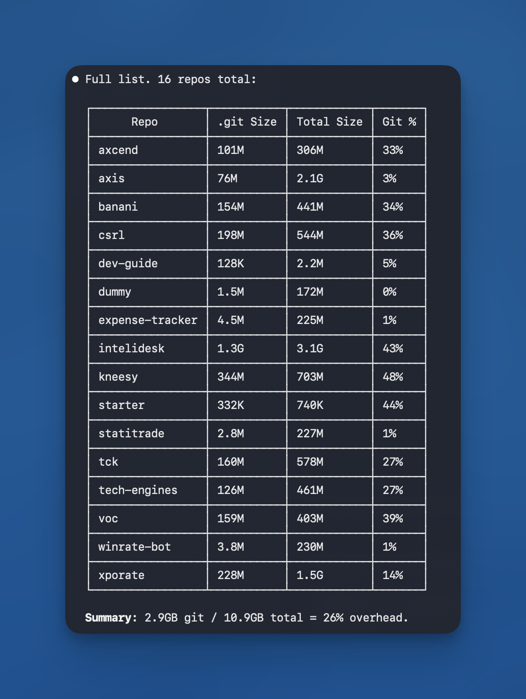

# Developer Guidelines: Git & GitHub

## Branching Strategy

- **`main`**: Production-ready code only. Merges only after testing & review.
- **`dev`**: Active development. All developers work here. Multiple commits allowed.

## Why It Matters

**Real Problem:** Projects hit `.git` folder bloat = ~50% of total repo size. Slow clones, wasted storage, painful history navigation.



**Root Cause:** Unoptimized files in commit history stay forever.

```
Commit 1: Add banner.jpg (15 MB uncompressed)
Commit 2: Optimize banner.jpg (2 MB)
Result: Git stores ALL 15 MB in history + 2 MB current = bloated repo
```

**How These Guidelines Fix It:**

1. **Optimize before commit** → No bloat enters history
2. **Squash merge dev → main** → Clean history, compact size
3. **Lean main branch** → Faster clones, lower storage

**Benefits:**

- `.git` stays under 10% of repo (was 50%)
- Clone in seconds, not minutes
- Clean production history for auditing

## Daily Workflow

**Key Rule:** Commit frequently. Each logical change = separate commit. Don't wait until end of day.

**Why:** Commit history becomes work log. Easier to debug. Revert single feature without touching others.

**Example:**

```
Frontend dev working on header & footer:
- 10:30 AM → Fix header navigation links → git commit
- 12:00 PM → Style footer responsive layout → git commit
- 2:15 PM → Add footer social icons → git commit
- 4:45 PM → Update header mobile menu → git commit
```

**Steps:**

```bash
# Start
git checkout dev
git pull origin dev

# Make one small change (header links, button styling, etc)
git add .
git commit -m "Fix header navigation link spacing"
git push origin dev

# Make another change 1-2 hours later
git add .
git commit -m "Add footer responsive padding on mobile"
git push origin dev

# Continue pattern throughout day
# When feature complete, create Pull Request: dev → main
# After review & approval, merge with squash
```

**Commit Message Format:** Start with verb. Describe what changed, not how.

- ✅ `Fix header navigation link spacing`
- ✅ `Add footer social media icons`
- ✅ `Update button hover state color`
- ❌ `Updated stuff`
- ❌ `Fixed bug in code`
- ❌ `Changes`

## Rules

✅ **DO:**

- Work on `dev` branch only
- Optimize images/assets BEFORE committing
- Write clear commit messages
- Pull before pushing

❌ **DON'T:**

- Work directly on `main`
- Commit large unoptimized files
- Commit sensitive info (API keys, passwords)
- Force push to shared branches
- Ignore merge conflicts

## Key Point

**Keep `main` pristine with minimal history. Experiment freely on `dev`. This saves storage, speeds up clones, and maintains clean production history.**
